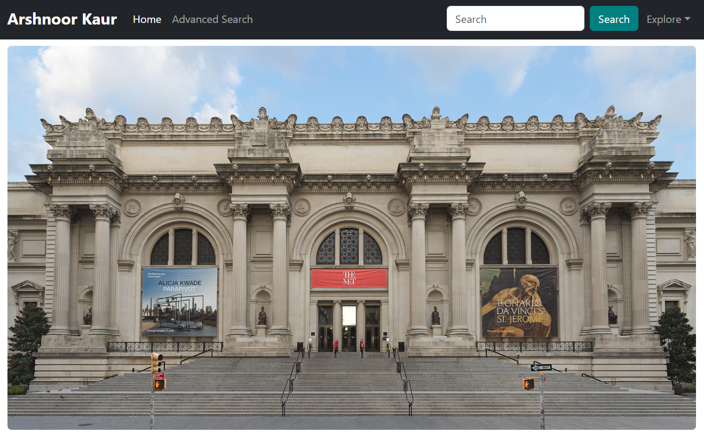

# 🎨 ArtistryHub

A modern, responsive web application for **searching and viewing artworks** from the **Metropolitan Museum of Art Collection API**. Built with **Next.js**, **React**, and **React Bootstrap**, featuring advanced search, artwork detail views, and a polished user interface.


## 🏠 Home Page


You can see the **live working application** here: [ArtistryHub Live Demo](https://drive.google.com/file/d/1D7qU6fzz9Zht3Jp3w0k9UyM2CRPA9iOB/view?usp=sharing)


## 🏆 Features

- **🔍 Smart Search & Advanced Filters** – Search by title, medium, location, highlights, and more.  
- **🖼 Artwork Cards** – Browse artworks in a responsive card layout with image, title, date, classification, and medium.  
- **📄 Artwork Details** – Detailed view with artist info, dimensions, credit line, and links to Wikidata.  
- **🧭 Pagination** – Navigate through artwork results 12 per page.  
- **📋 Form Validation** – React Hook Form validation for required search fields.  
- **📱 Responsive Design** – Optimized for all devices with Bootstrap.  
- **❤️ Favourites** – Add artwork to your favourites and easily view them.  
- **🕒 Search History** – Keep track of your previous searches and re-run them easily.  

---

## 🛠 Tech Stack  

- **Frontend**: Next.js, React, Bootstrap  
- **State Management**: Jotai  
- **Data Fetching**: SWR (caching & revalidation)  
- **Authentication**: JWT  
- **Database**: MongoDB Atlas  
- **Deployment**: Vercel  
- **External API**: [Metropolitan Museum of Art Collection API](https://collectionapi.metmuseum.org/public/collection/v1/)  

---

## ⚡ Setup & Installation

### Prerequisites
- Node.js, MongoDB database (or MongoDB Atlas), Visual Studio Code

### Installation Steps

1. **Create Next.js App**
```bash
npx create-next-app@latest artistryhub
cd artistryhub
```

2. **Install dependencies**
```bash
npm install swr bootstrap react-bootstrap react-hook-form jotai
```

3. **Start development server**
```bash
npm run dev
```

4. **Open your browser**
```
http://localhost:3000
```

## 🔧 Architecture

This project follows a **modular architecture** to ensure scalability and maintainability:

- **Frontend**: Built with **Next.js**, the application consumes the [Metropolitan Museum of Art Collection API](https://www.metmuseum.org/art/collection) to display and search artworks seamlessly.

- **Backend APIs**: (Optional) The backend can handle user authentication, favorites, and search history management. It provides APIs to persist user-specific data.

- **Components**: The app is designed using **modular React components** for reusable and maintainable code. These include:
  - **Layout**: Core structure and styling for all pages.
  - **Navbar**: Responsive navigation menu.
  - **Artwork Cards**: Displays artwork in a clean and responsive card format.
  - **Artwork Detail Views**: Provides detailed artwork information, including artist data and links to Wikidata.

- **Data Fetching**: Utilizes **SWR** for efficient data fetching with automatic caching and error handling to improve performance and user experience.

---

## 🤝 Contributing

Contributions are always welcome! 

If you want to contribute to ArtistryHub, fork the repo, create a new branch, and make your changes. Ensure your code is clean, tested, and follows the existing structure. Push your branch to your fork and open a **pull request** describing your changes for review and merging.

---

## 📧 Contact Me

- **Arshnoor Kaur**
  - GitHub: [@arshnoork-101](https://github.com/arshnoork-101/)
  - LinkedIn: [Arshnoor Kaur](https://www.linkedin.com/in/arshnoorkaurjuj/)

---

⭐ **Star this repo if you found it helpful!**


